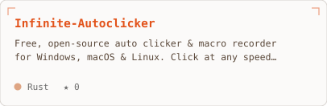
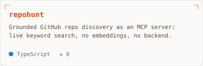
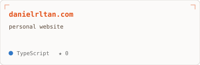
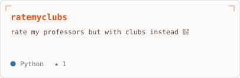

<picture>
  <source media="(prefers-color-scheme: dark)" srcset="./hero-dark.svg">
  
</picture>

  <picture>
  <source media="(prefers-color-scheme: dark)" srcset="https://komarev.com/ghpvc/?username=danielrltan&color=ff6b35&style=for-the-badge&label=Profile+Visitors">
  
</picture>
  &nbsp;
  <a href="https://github.com/danielrltan?tab=followers"><picture>
  <source media="(prefers-color-scheme: dark)" srcset="https://img.shields.io/github/followers/danielrltan?style=for-the-badge&color=ff6b35&labelColor=0d1117&logo=github">
  
</picture></a>

<h3>&rarr;&nbsp; whoami</h3>

<picture>
  <source media="(prefers-color-scheme: dark)" srcset="./profile-dark.svg">
  
</picture>

<h3>&rarr;&nbsp; work</h3>

<table align="center">
  <tr><td><a href="https://github.com/danielrltan/Infinite-Autoclicker"><picture>
  <source media="(prefers-color-scheme: dark)" srcset="./card-Infinite-Autoclicker-dark.svg">
  
</picture></a></td><td><a href="https://github.com/danielrltan/repohunt"><picture>
  <source media="(prefers-color-scheme: dark)" srcset="./card-repohunt-dark.svg">
  
</picture></a></td></tr>
  <tr><td><a href="https://github.com/danielrltan/danielrltan.com"><picture>
  <source media="(prefers-color-scheme: dark)" srcset="./card-danielrltan.com-dark.svg">
  
</picture></a></td><td><a href="https://github.com/danielrltan/ratemyclubs"><picture>
  <source media="(prefers-color-scheme: dark)" srcset="./card-ratemyclubs-dark.svg">
  
</picture></a></td></tr>
</table>

<h3>&rarr;&nbsp; signal</h3>

<picture>
  <source media="(prefers-color-scheme: dark)" srcset="https://github-readme-activity-graph.vercel.app/graph?username=danielrltan&bg_color=0d1117&color=ff6b35&line=ff6b35&point=f5e6d3&area=true&hide_border=true&radius=8&custom_title=Contribution%20Graph">
  
</picture>

<h3>&rarr;&nbsp; reach</h3>

  <a href="https://danielrltan.com"><picture>
  <source media="(prefers-color-scheme: dark)" srcset="https://img.shields.io/badge/Website-0d1117?style=for-the-badge&logo=safari&logoColor=ff6b35">
  
</picture></a>
  <a href="mailto:hello@danielrltan.com"><picture>
  <source media="(prefers-color-scheme: dark)" srcset="https://img.shields.io/badge/Email-0d1117?style=for-the-badge&logo=maildotru&logoColor=ff6b35">
  
</picture></a>
  <a href="https://linkedin.com/in/danielrltan"><picture>
  <source media="(prefers-color-scheme: dark)" srcset="https://img.shields.io/badge/LinkedIn-0d1117?style=for-the-badge&logo=linkedin&logoColor=ff6b35">
  
</picture></a>
  <a href="https://twitter.com/danielrltan"><picture>
  <source media="(prefers-color-scheme: dark)" srcset="https://img.shields.io/badge/Twitter-0d1117?style=for-the-badge&logo=x&logoColor=ff6b35">
  
</picture></a>

