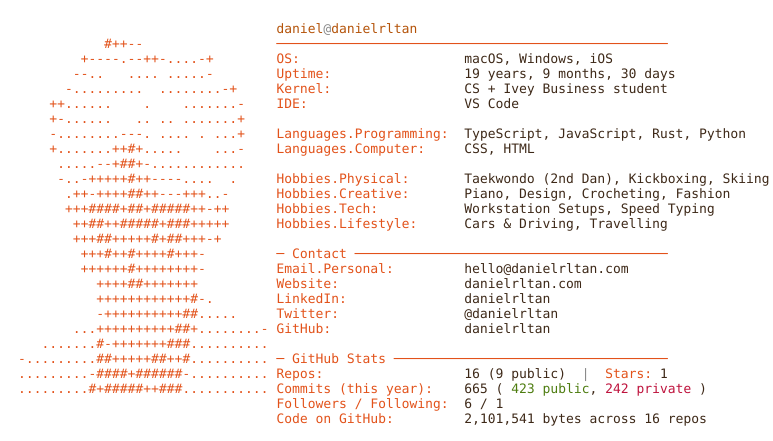

<picture>
  <source media="(prefers-color-scheme: dark)" srcset="./profile-dark.svg">
  
</picture>

<picture>
  <source media="(prefers-color-scheme: dark)" srcset="https://github-readme-activity-graph.vercel.app/graph?username=danielrltan&bg_color=0d1117&color=E58D7A&line=f59e0b&point=f5e6d3&area=true&hide_border=true&radius=8&custom_title=Contribution%20Graph">
  
</picture>

  <picture>
  <source media="(prefers-color-scheme: dark)" srcset="https://komarev.com/ghpvc/?username=danielrltan&color=E58D7A&style=for-the-badge&label=Profile+Visitors">
  
</picture>
  &nbsp;
  <a href="https://github.com/danielrltan?tab=followers"><picture>
  <source media="(prefers-color-scheme: dark)" srcset="https://img.shields.io/github/followers/danielrltan?style=for-the-badge&color=E58D7A&labelColor=0d1117&logo=github">
  
</picture></a>

